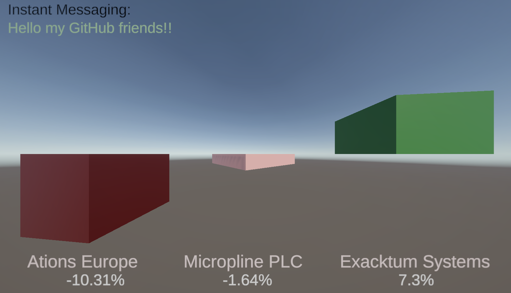

# Lightstreamer - Basic Demo - Unity Client

<!-- START DESCRIPTION lightstreamer-example-basic2-client-unity -->

This project includes a demo client showing the integration between [Lightstreamer server](https://www.lightstreamer.com/) and the [Unity 2017 Development platform](https://unity3d.com/).<br>

## Live Demo

[](https://demos.lightstreamer.com/UnityDemo/BasicUnityDemo.zip)<br>

### [ View live demo](http://demos.lightstreamer.com/UnityDemo2/BasicUnityDemo.zip)<br>
(for Windows systems: download BasicUnityDemo.zip; unzip it; launch BasicUnityDemo.exe)<br>
(for Linux systems: download BasicUnityDemo.zip; unzip it; launch BasicUnityDemo.x86)<br>
(for Android devices: download BasicUnityDemo.zip; unzip it; install BasicUnityDemo.apk manually on your Android device)

## Details

The demo intends to show a reference pattern for using <b>.Net Standard Client API</b> for Lightstreamer in a Unity 3d project in order to add sources of real-time information to which game objects in a scene can react.
Specifically, the demo includes two `cube` 3D ojects that change their size and color according to the real-time information received through the StockList Data Adapter, the same of the [StockList demo](https://github.com/Lightstreamer/Lightstreamer-example-StockList-client-javascript).
In addition a `3D Text` object acts as very very simple chat based on the [Round-Trip demo](https://github.com/Lightstreamer/Lightstreamer-example-RoundTrip-client-javascript). 

All the objects who want to communicate with the Lightstreamer server should be children of the same parent object, in this demo called 'World', and be tagged with a label that starts with the string 'lightstreamer'.
To 'World' has been added the `LighstreamerClientAsset` component, which will take care of opening a Lightstreamer session with the information provided in the parameters: `Push Url` and `Adapters Set`.

All the child objects can ask to open a [Subscription](https://lightstreamer.com/api/ls-dotnetstandard-client/latest/api/com.lightstreamer.client.Subscription.html) versus the Lightstreamer server by setting these parameters of the `LighstreamerAsset` component: ItemName, Schema, DataAdapter.
The LightstreamerClientAsset component of the World object will perform all the subscriptions specified by child objects, and will communicate with them through two types of messages :

* RTStatus - a message of this type provides information about the status of communication with the Lightstreamer server.
* RTUpdates - this type of messages brings a [ItemUpdate](https://lightstreamer.com/api/ls-dotnetstandard-client/latest/api/com.lightstreamer.client.ItemUpdate.html) object of the Lightstreamer .NET clien library.

### Dig the Code

The Lightstreamer bits in this demo are located inside C# scripts in the `Assets/` directory.<br>

In detail the files with the source code are:
* `LighstreamerClientAsset` is the class that manages the connection to the Lightstreamer server and all the subscriptions. Redistributes received updates by broadcasting messages to all the child objects of the object game it is added.
* `LighstreamerAsset` is a base class that should be extended by all those components who want to consume real time events from Lightstreamer server. 
* `LightstreamerCubeAsset.cs` is the Lightstreamer component, extension of `LighstreamerAsset` base class, that can be associated to a Cube object. Upon receipt of a message, 
after verifying that the involved Item is the one specified in the ItemName parameter, change the color of the cube by setting parameterized rgb values based on the value of the last_price field (I admit this does not make much sense, it's just an example), and modify the cube size (y axis only) in pase to the pct_change field value.
* `LightstreamerMsgAsset.cs` is the Lightstreamer component, extension of `LighstreamerAsset` base class, that can be associated to a 3D Text object to display the message of an Item of Round-Trip demo specified in ItemName parameter.
In addition this class read the Input and sends the typed message to the server.
* `ConnectionListener.cs` is the implementation of [ClientListener](https://lightstreamer.com/api/ls-dotnetstandard-client/latest/api/com.lightstreamer.client.ClientListener.html) interface to handle notifications of connection activity and errors. 
* `TableListener.cs` is the implementation of [SubscriptionListener](https://lightstreamer.com/api/ls-dotnetstandard-client/latest/api/com.lightstreamer.client.SubscriptionListener.html) interface to handle notification of data updates and subscription termination.

Check out the sources for further explanations. The Lightstreamer Documentation is available at: http://www.lightstreamer.com/doc<br>

<i>NOTE: Not all the functionalities of the .Net Standard Client API for Lightstreamer are exposed by the classes listed above. You can easily expand those functionalities using the [Lightstreamer .NET Standard API](https://lightstreamer.com/api/ls-dotnetstandard-client/latest/api/Index.html) as a reference. </i>

For any inquiry, please email support@lightstreamer.com.

<!-- END DESCRIPTION lightstreamer-example-basic2-client-unity -->

## Install

If you want to install a version of this demo pointing to your local Lightstreamer Server, follow these steps:

* Note that, as prerequisite, the [Lightstreamer - Stock-List Demo - Java Adapter](https://github.com/Weswit/Lightstreamer-example-Stocklist-adapter-java) and the [Lightstreamer - Round-Trip Demo - Java Adapter](https://github.com/Lightstreamer/Lightstreamer-example-RoundTrip-adapter-java) has to be deployed, together in the same Adapter Set, on your local Lightstreamer Server instance.
The adapters.xml file for the Portfolio Demo, should look like:
```xml 
<?xml version="1.0"?>

<!-- Mandatory. Define an Adapter Set and sets its unique ID. -->
  <adapters_conf id="DEMO">
  
    <!--
      Not all configuration options of an Adapter Set are exposed by this file.
      You can easily expand your configurations using the generic template,
      `DOCS-SDKs/sdk_adapter_java_inprocess/doc/adapter_conf_template/adapters.xml`,
      as a reference.
    -->

    <metadata_adapter_initialised_first>Y</metadata_adapter_initialised_first>
	
	<metadata_provider>

		<install_dir>roundtrip</install_dir>
	
        <adapter_class>roundtrip_demo.adapters.RoundTripMetadataAdapter</adapter_class>

        <!-- Optional for RoundTripMetadataAdapter.
               Configuration file for the Adapter's own logging.
               Logging is managed through log4j. -->
        <param name="log_config">adapters_log_conf.xml</param>
        <param name="log_config_refresh_seconds">10</param>

        <!-- Optional, managed by the inherited LiteralBasedProvider.
               See LiteralBasedProvider javadoc. -->
        <!--
        <param name="max_bandwidth">40</param>
        <param name="max_frequency">3</param>
        <param name="buffer_size">30</param>
        <param name="prefilter_frequency">5</param>
        <param name="allowed_users">user123,user456</param>
        <param name="distinct_snapshot_length">30</param>
        -->

        <!-- Optional, managed by the inherited LiteralBasedProvider.
               See LiteralBasedProvider javadoc. -->
        <param name="item_family_1">roundtrip\d{1,2}</param>
        <param name="modes_for_item_family_1">MERGE</param>
		
        <param name="item_family_2">item.*</param>
        <param name="modes_for_item_family_2">MERGE</param>

    </metadata_provider>

    <!-- Mandatory. Define the Data Adapter. -->
    <data_provider name="ROUNDTRIP_ADAPTER">
	  
	    <install_dir>roundtrip</install_dir>

        <adapter_class>roundtrip_demo.adapters.RoundTripDataAdapter</adapter_class>

    </data_provider>

	<!-- Mandatory. Define the Data Adapter. -->
	<data_provider name="QUOTE_ADAPTER">

	    <install_dir>Stocklist</install_dir>

		<!-- Mandatory. Java class name of the adapter. -->
		<adapter_class>stocklist_demo.adapters.StockQuotesDataAdapter</adapter_class>

    </data_provider>

  </adapters_conf>
```
* Launch Lightstreamer Server.
* Download the `deploy.zip` file, which you can find in the [deploy release](https://github.com/Lightstreamer/Lightstreamer-example-basic2-client-unity/releases) of this project and extract the `BasicUnityDemo` folder.
* Launch `BasicUnityDemo.exe` (please note that the demo tries to connect to http://localhost:8080).

## Build

To build your own version of `UnityDemo.exe`, instead of using the one provided in the `deploy.zip` file from the [Install](https://github.com/Lightstreamer/Lightstreamer-example-basic2-client-unity#install) section above, follow these steps:

* A Unity 2018 Development platform must be installed to build and run this demo. Download and Install Unity 3D from: [https://unity3d.com/get-unity/download](https://unity3d.com/get-unity/download).
* Clone this project: `> git clone https://github.com/Weswit/Lightstreamer-example-basic2-client-unity`.
* Get the  binaries files of the library (`Lightstreamer_DotNet_Standard_Client.dll` and `Lightstreamer_DotNet_Standard_Client.pdb`) and all dependecies from NuGet [Lightstreamer.DotNetStandard.Client](https://www.nuget.org/packages/Lightstreamer.DotNetStandard.Client/) version 5.0.0 or higher and put them in the `Assets\LightstreamerClient` new folder; then import it as a new Asset.
* Open `SndScene.unity` file in `Asset` subfolder double clicking on it. The Unity Development Environment should open.
* You can then build and run the project by menu `File` and then `Build & Run`.
* Please note that in the inspector of the `World` object you can choose the Lightstreamer server targeted by the demo; you can change the `Push Url` parameter to 'http://localhost:8080' or 'http://push.lightstreamer.com' depending you want to use your local instance of Lightstremaer server or our public installations.

## See Also

### Lightstreamer Adapters Needed by This Demo Client

<!-- START RELATED_ENTRIES -->
* [Lightstreamer - Stock-List Demo - Java Adapter](https://github.com/Weswit/Lightstreamer-example-Stocklist-adapter-java)
* [Lightstreamer - Round-Trip Demo - Java Adapter](https://github.com/Lightstreamer/Lightstreamer-example-RoundTrip-adapter-java)

<!-- END RELATED_ENTRIES -->

### Related Projects

* [Lightstreamer - Stock-List Demos - HTML Clients](https://github.com/Weswit/Lightstreamer-example-Stocklist-client-javascript)
* [Lightstreamer - Round-Trip Demo - HTML Client](https://github.com/Lightstreamer/Lightstreamer-example-RoundTrip-client-javascript)
* [Lightstreamer - 3D World Demo - HTML (Three.js) Client](https://github.com/Weswit/Lightstreamer-example-3DWorld-client-javascript)

## Lightstreamer Compatibility Notes

* Compatible with Lightstreamer .NET Standard Client Library version 4.0.0 or newer.
* For Lightstreamer Server version 7.0 or greater. Ensure that .NET Standard Client API is supported by Lightstreamer Server license configuration.
